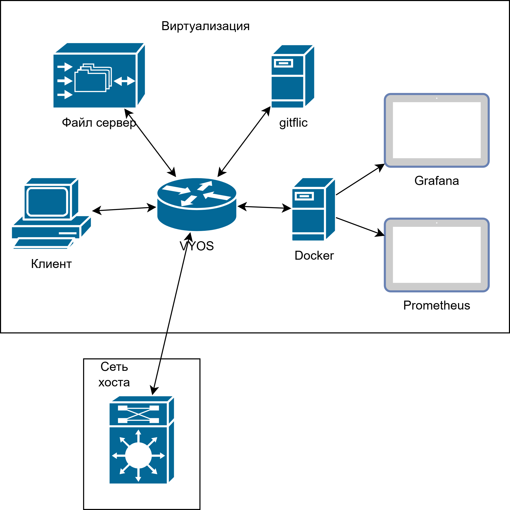

# It--

## Уровень 1

Для уровня 1 я реши поставить linux mint.
Для виртуальной машины я создал внутренюю сеть
Установил Filezilla для доступа по ftp на файлопомойку.

## Уровень 2

В ВМ я подключил два адаптера:

* Внутреняя сеть, подключенная к виртуальному порту *eth0*
* Сеть NAT, подключенная к виртуальному порту *eth1*

Для уровня 2 решил поставить на виртульную машину VYOS. VYOS нужен для маршрутизации и выхода в интернет. На VYOS завел DHCP сервер. *eth0* будет использовать статический IP-адрес 192.168.0.1 с префиксом 24.

* Шлюз по умолчанию и адрес рекурсора DNS будут 192.168.0.1/24

* Диапазон адресов будет зарезервирован для статических назначений.192.168.0.2/24 - 192.168.0.8/24

* Клиентам DHCP будут назначены IP-адреса в диапазоне и доменное имя 192.168.0.9 - 192.168.0.254

* Аренда DHCP будет действовать в течение одного дня (86400 секунд)

* VyOS будет выступать в качестве полноценного DNS-рекурсора, устраняя необходимость использования Google, Cloudflare или других публичных DNS-серверов (что хорошо для конфиденциальности)

* Только хосты из вашей внутренней/LAN сети могут использовать DNS-рекурсор.

Теперь настроим NAT для доступа в интернет

* Устанавливим правило NAT, указывая, что оно применяется к исходящему трафику через интерфейс eth0

* Это правило применяется к трафику, исходящему из сети 192.168.0.0/24

* Исходный адрес пакетов будет подменяться на IP-адрес интерфейса eth0

## Уровень 3

Для уровня 3 я решил поставить на виртуальку TrueNAS, т.е платформу для хранения и управления данными.
Для надежного гранения данных я решил создать RAID-Z2 из 4 дисков (до 2 одновременного отказа дисков).
Создал локального пользователя User и группу FTPUsers, добавил этого пользователя в грппу ftp.
Настроил автозапуст ftp сервера.

Теперь пользователь User может использовать наше хранилище.

Для стабильного доступа в файлопомойке, просвоим ей статический адрес, например **192.168.0.2**

## Уровень 4

Хорошо, давайте теперь установим gitflic. Создадим виртуалку на Debian 12,которая имеет доступ только к внутреней сети. И начнем устанавливать зависимости. Кстати с oracle из России теперь нельзя скачивать java.

Т.к Debian 12 не поддержтвает JDK 11, установим JDK 17.

Настроим конфигурацию gitflic для доступа внутри внустреней сети. Теперь мы можем пользоваться git внутри сети.

## Уровань 5

Используя документацию к docker установим docker на ещё одну ВМ Debian 12, имеющую доступ только к внутреней сети. Docker заработал сразу и без проблем.

Установим и запустим Prometheus и Grafana, соответсвенно на локальных портах 9090 и 3000. К сожалению времени на настроку оказалось не достаточно.

### Топология сети

